# Wi-Fi Security Lab


## Overview

This project documents a controlled Wi-Fi security lab performed on my own wireless network and personal tablet.

The main objective was to explore basic 802.11 wireless monitoring concepts using the Aircrack-ng suite, including monitor mode, access point discovery, station identification, signal observation, and directed deauthentication testing.

During the lab, I also observed how MAC address randomization can affect client identification and how the behavior changes when the device uses its hardware MAC address.

> All testing was performed only on devices and networks under my control.

## Lab Environment

- Operating System: Garuda Linux
- Wireless toolkit: Aircrack-ng
- Wireless interface: Intel Wireless-AC adapter using the `iwlwifi` driver
- Test network: Personal Wi-Fi access point
- Test client: Personal tablet
- Wireless security: WPA2-PSK (CCMP)
- Test band/channel: 2.4 GHz, channel 10

## 1. Wireless Interface Preparation

Before starting the wireless analysis, I verified the current state of the Wi-Fi interface.

The interface was operating in **Managed mode**, which is the normal mode used to connect to wireless networks.

```
iwconfig
```

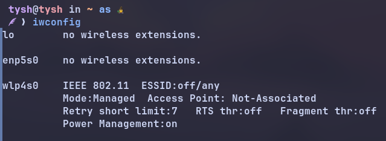

### Checking wireless radio status

I checked whether the wireless interface was blocked by software or hardware before enabling monitor mode.

```
sudo rfkill list
```

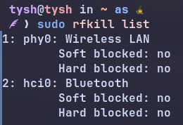
### Stopping interfering processes

Some background services can interfere with monitor mode by attempting to control the wireless interface.

I used Aircrack-ng to stop those processes before enabling monitor mode.

```
sudo airmon-ng check kill
```

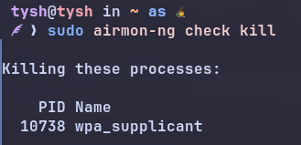
## 2. Enabling Monitor Mode

To capture nearby 802.11 traffic, the wireless interface must operate in **Monitor mode** instead of Managed mode.

I enabled monitor mode using:

```
sudo airmon-ng start wlp4s0
```

The interface changed from: `wlp4s0` -> `wlp4s0mon`

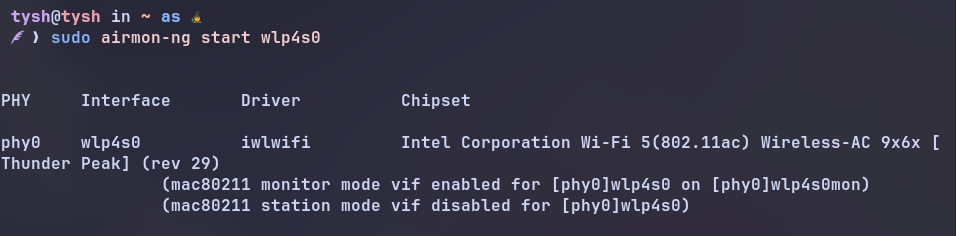

I verified the new interface mode using:

```
iwconfig
```

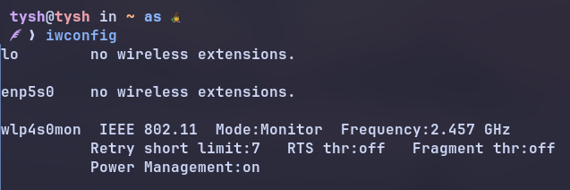
## 3. Access Point Discovery

With the wireless interface in Monitor mode, I used `airodump-ng` to scan for nearby wireless networks:

```
sudo airodump-ng wlp4s0mon
```

The scan displayed nearby access points and information such as:

- `BSSID` — MAC address of the access point
- `PWR` — received signal strength
- `CH` — wireless channel
- `ENC` — encryption type
- `CIPHER` — encryption algorithm
- `AUTH` — authentication method
- `ESSID` — network name

I let the scan run for approximately 30 seconds, which was enough to identify the access point used for this lab.

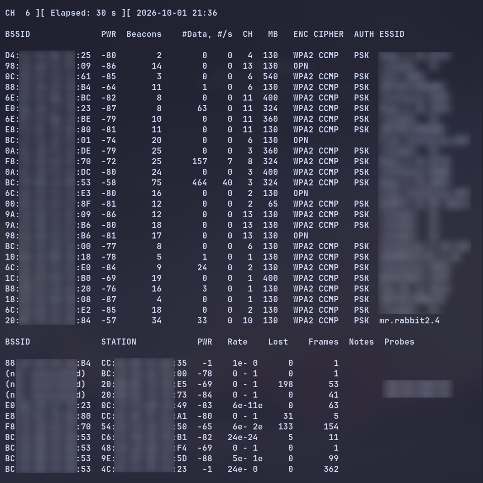
### Monitoring the test access point

Once the test network was identified, I restricted the capture to its channel and BSSID.

```
sudo airodump-ng -c 10 --bssid <AP_BSSID> wlp4s0mon
```

In this command:

- -c 10 specifies the channel used by the access point.
- --bssid <AP_BSSID> filters the capture to the selected access point.
- wlp4s0mon is the wireless interface operating in Monitor mode.

This made it easier to observe only the traffic and stations associated with the test network.

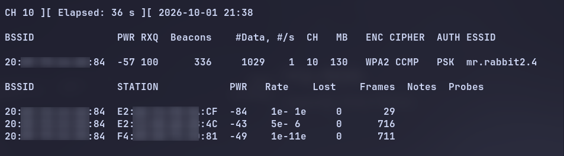

The `STATION` section shows wireless client devices observed communicating with the selected access point.

At this point, the tablet used as the test client was connected to the Wi-Fi network and actively using the connection.

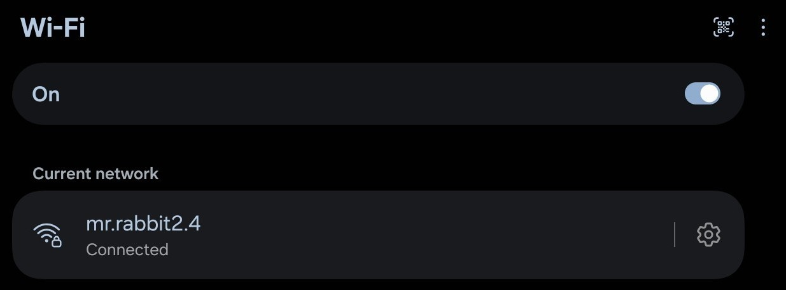

## 4. Directed Deauthentication Test

After identifying the test tablet in the `STATION` list, I performed a directed deauthentication test against that client.

The test was performed only on my own access point and personal tablet.

### What is a Deauthentication Frame?

IEEE 802.11 defines **Deauthentication** as a subtype of **Management frame**.

A deauthentication frame is used to terminate an existing authentication relationship between two wireless stations. Because authentication is a prerequisite for association, deauthentication also causes the station to become disassociated from the network.

A Deauthentication frame contains a **Reason Code**, which indicates why the deauthentication notification was generated.

According to IEEE Std 802.11-2024, deauthentication is a **notification rather than a request** and may be initiated by either authenticated party, such as an access point or a client station.

> **Management Frame Protection (PMF):** IEEE 802.11 classifies Deauthentication as a robust Management frame. When Management Frame Protection is negotiated, robust Management frames can be cryptographically protected, which changes how invalid or forged deauthentication frames are handled.

### How the Directed Test Works

The deauthentication frames used in this test were not generated by the legitimate access point or tablet.

Instead, `aireplay-ng` uses **802.11 frame injection** to transmit crafted deauthentication frames from the wireless adapter running the test.

In a deauthentication attack, addressing information can be forged so that the injected management frames appear to originate from one of the legitimate wireless devices. This can be described as **MAC address spoofing/forging combined with 802.11 frame injection**.

Although the frame contains MAC addressing associated with the legitimate AP/client relationship, the actual radio transmission is generated by the wireless adapter running `aireplay-ng`.

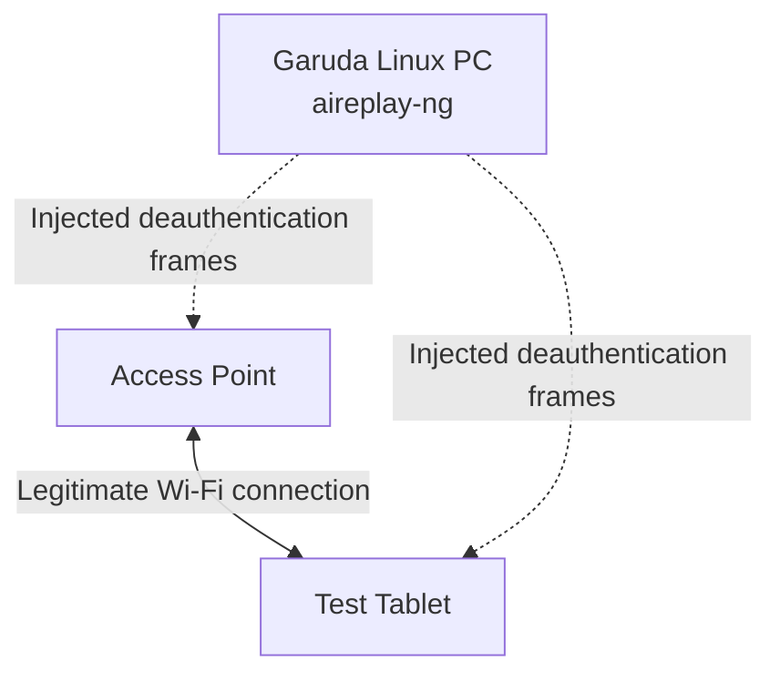

### Running the Test
I ran the following command:

```
sudo aireplay-ng -0 0 -a <AP_BSSID> -c <CLIENT_MAC> wlp4s0mon
```

In this command:

- -0 selects deauthentication mode.
- 0 sends deauthentication frames continuously until the command is stopped manually.
- -a <AP_BSSID> specifies the BSSID of the access point.
- -c <CLIENT_MAC> specifies the target client station.
- wlp4s0mon is the wireless interface in Monitor mode.

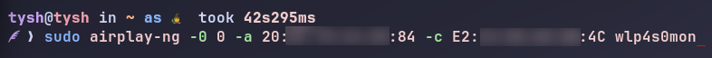

### Observing the deauthentication traffic

While `aireplay-ng` was running, the terminal repeatedly displayed output similar to:

```
Sending 64 directed DeAuth (code 7). STMAC: [CLIENT_MAC] [17|64 ACKs]
```

The output provides information about the transmitted deauthentication frames:

- `64 directed DeAuth` — `aireplay-ng` is transmitting a burst of 64 deauthentication frames as part of the directed deauthentication test.
- ``code 7`` — IEEE 802.11 reason code 7 (`INVALID_CLASS3_FRAME`), meaning that a Class 3 frame was received from a station considered not associated with the access point.
- `STMAC` — identifies the MAC address of the target station.
- [17|64 ACKs] — shows acknowledgements received during the transmission:
  - `17` ACKs from the client station
  - `64` ACKs from the access point

For a directed deauthentication, Aircrack-ng documents that `aireplay-ng` sends a total of **128 packets for each specified deauthentication**:

- 64 packets toward the access point
- 64 packets toward the client

This explains why the output reports ACKs separately for both sides of the wireless connection.

An `ACK` (Acknowledgment) in this context refers to the IEEE 802.11 acknowledgment mechanism, not the TCP ACK flag.

IEEE 802.11 defines `Ack` as a subtype of **Control frame** and specifies that, when acknowledgment is required, the addressed recipient returns an Ack frame after a Short Interframe Space (SIFS).

In the `aireplay-ng` output:

```text
[client ACKs | AP ACKs]
```

> **Note:** This is a simplified view showing only the IEEE 802.11 frame types and subtypes discussed in this lab. The standard defines additional frame types and subtypes that are not shown here.
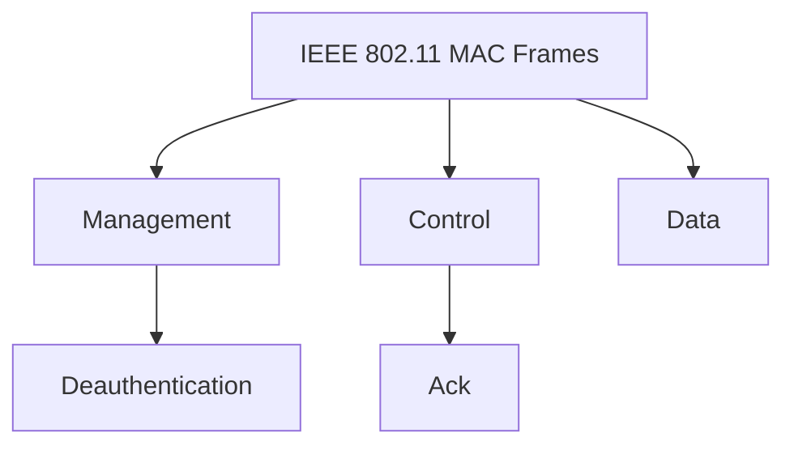

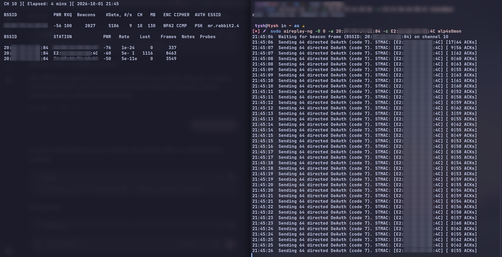

At the same time, I monitored the selected access point using `airodump-ng`.

The `Lost` value associated with the target station increased while the deauthentication test was running, showing that communication between the client and access point was being disrupted.

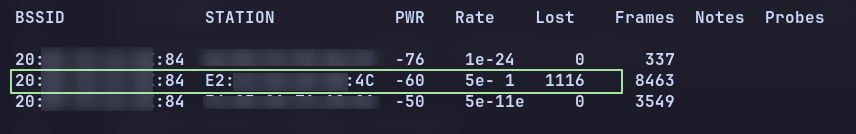

### Client disconnection

After the test had been running for a short period, the tablet lost its connection to the monitored 2.4 GHz network.

Because another saved Wi-Fi network was available, the tablet automatically connected to the 5 GHz network instead.

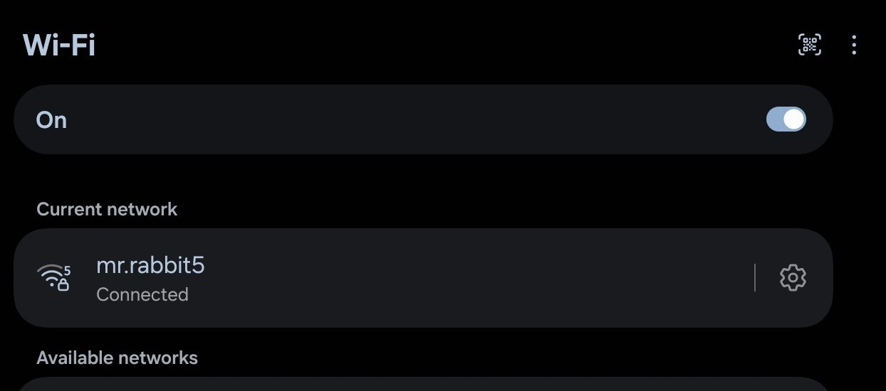

I then attempted to reconnect the tablet to the original 2.4 GHz network.

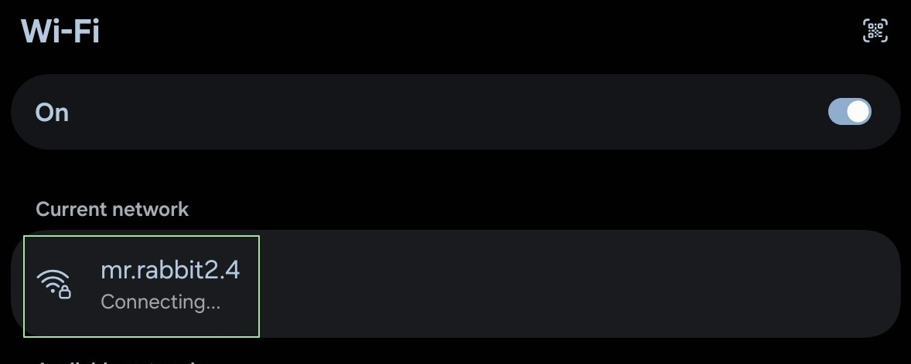
## 5. MAC Address Randomization Observation

After reconnecting the tablet to the original Wi-Fi network, the device appeared in `airodump-ng` with a different client MAC address.

This happened because the tablet was configured to use a **randomized MAC address** for that Wi-Fi network.

Instead of reusing the same client MAC address that had been targeted by `aireplay-ng`, the tablet appeared as a new station with a different MAC address.

As a result, the deauthentication command that was still running continued targeting the previous client address, while the tablet was now communicating with the access point using a new randomized MAC address.

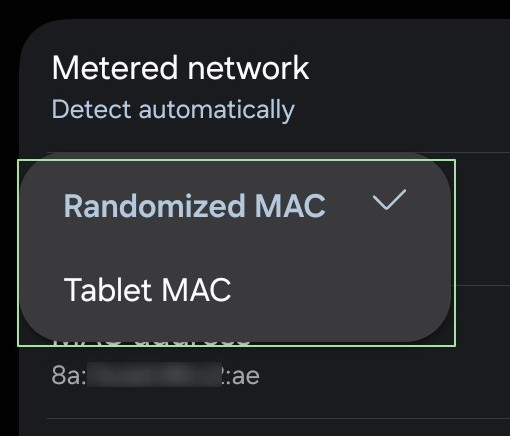

The change was also visible while monitoring the selected network with `airodump-ng`, where the tablet appeared as a new `STATION` with a different MAC address.

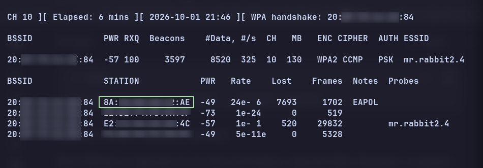

### Observation

This demonstrated an important limitation when identifying wireless clients only by their MAC address.

A device using MAC address randomization may appear as a different station after reconnecting, even though it is still the same physical device.

In this test, the original deauthentication process continued targeting the old station address, while the tablet had already reconnected using a different randomized MAC address.

## 6. Static MAC Address Comparison

To compare the behavior, I changed the tablet Wi-Fi privacy setting from a randomized MAC address to the device MAC address.

This allowed the tablet to connect using its hardware MAC address instead of a temporary randomized address.

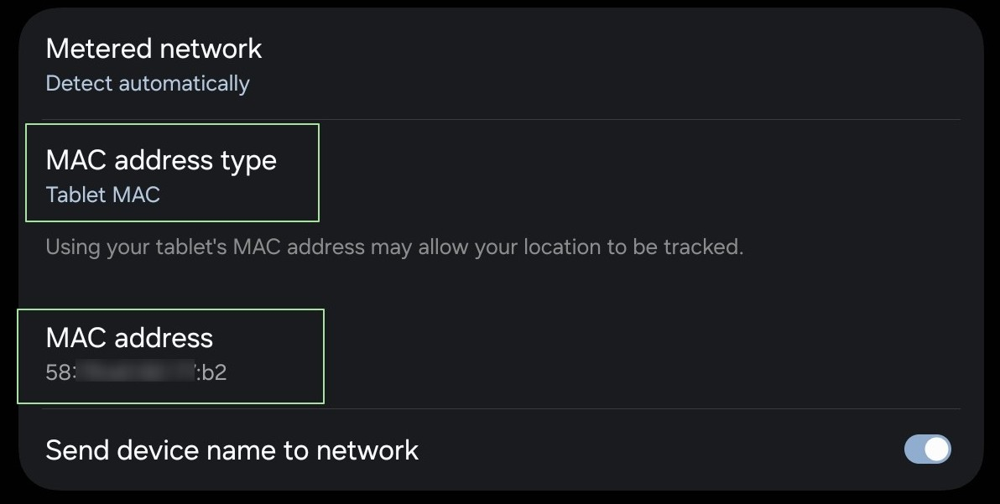

Once the tablet reconnected, `airodump-ng` showed a new station using the device MAC address.

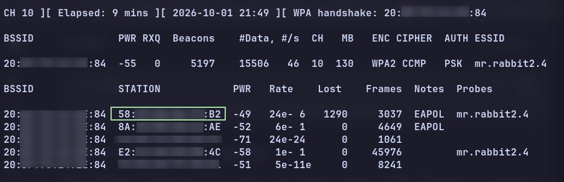

I repeated the directed deauthentication test using the tablet's device MAC address:

```
sudo aireplay-ng -0 0 -a <AP_BSSID> -c <DEVICE_MAC> wlp4s0mon
```

While the test was running, the Lost value for the station increased and the tablet lost connectivity to the Wi-Fi network.

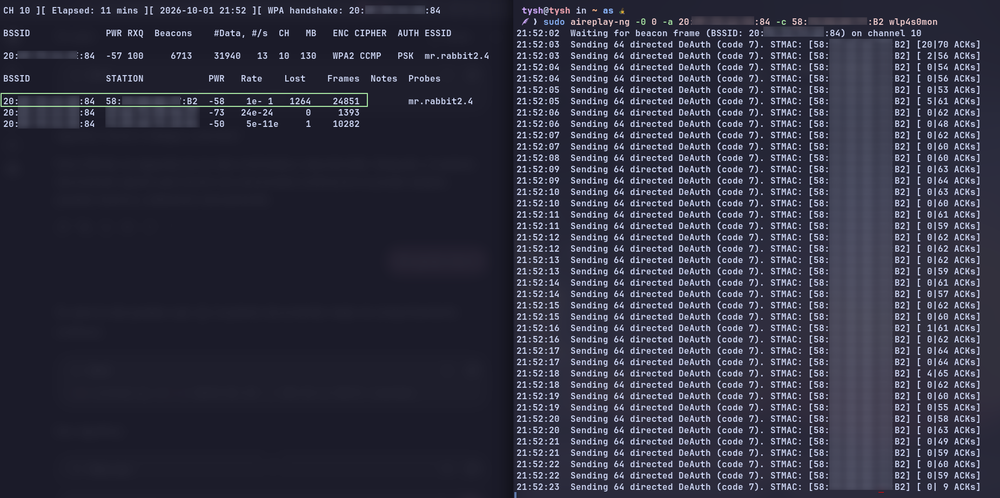

The tablet was unable to reconnect successfully while the continuous deauthentication test was still running.

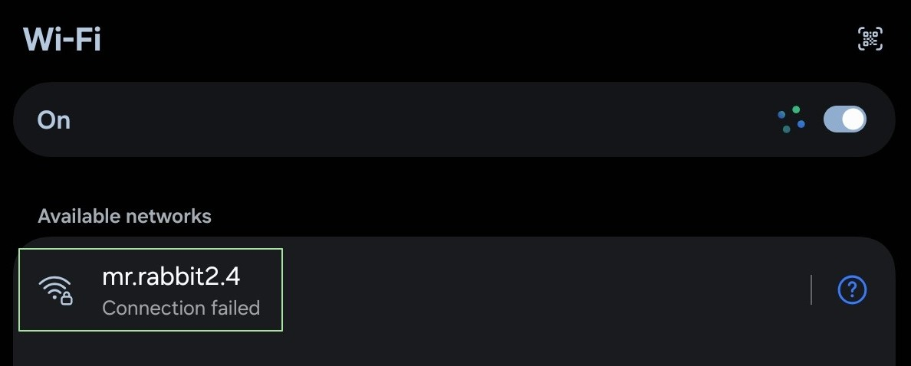

## 7. Ending the Test and Restoring Connectivity

After stopping the continuous deauthentication test, the tablet was able to connect to the Wi-Fi network again.

This confirmed that the connectivity problem was caused by the active deauthentication test rather than by a permanent configuration issue.


For privacy, I changed the tablet back to using a randomized MAC address after completing the test.

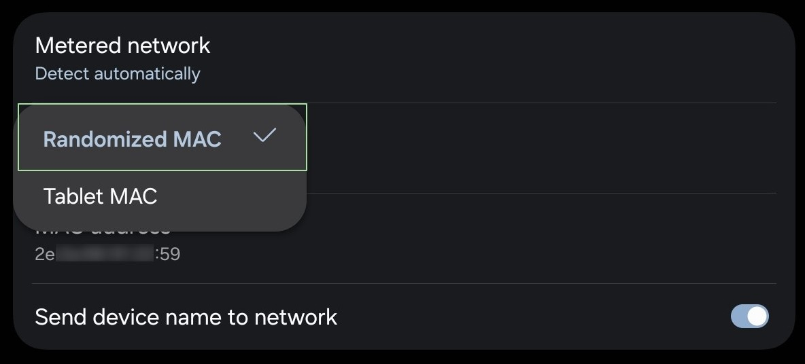

### Disabling Monitor Mode

After completing the wireless test, I disabled Monitor mode:

```
sudo airmon-ng stop wlp4s0mon
```

This removed the monitor interface and restored the wireless adapter to its normal operating state.

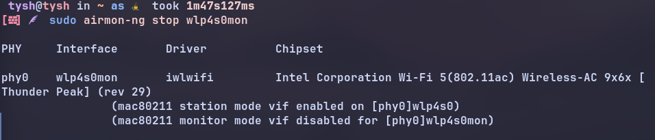
### Restoring NetworkManager

Finally, I restarted NetworkManager:

```
sudo systemctl restart NetworkManager
```

I then verified the interface again with:

```
iwconfig
```

The wireless interface was back in **Managed mode**, confirming that the system had returned to its normal Wi-Fi configuration.

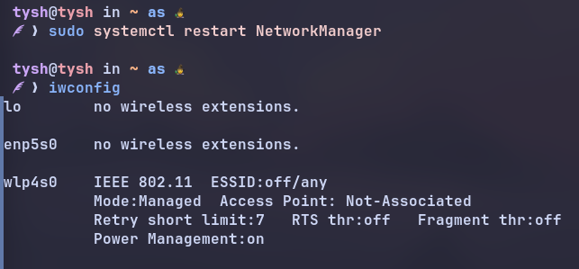

## 8. Key Findings

This lab helped me understand several practical aspects of 802.11 wireless security:

- Monitor mode allows a wireless adapter to observe nearby 802.11 traffic without being connected to an access point.
- `airodump-ng` can be used to identify access points, channels, signal strength, and observed client stations.
- A directed deauthentication test can temporarily disrupt communication between an access point and a specific client.
- The `Lost` value in `airodump-ng` can help indicate communication problems while the test is running.
- MAC address randomization can make the same physical device appear as a different station after reconnecting.
- A deauthentication process targeting an old randomized MAC address will not automatically follow the device when it reconnects using a different MAC address.
- Using the device MAC allowed me to observe the difference between a changing client identifier and a stable one.

## Disclaimer

This project was performed exclusively in a controlled environment using my own wireless network and personal devices.

The purpose of this lab was educational: to understand wireless monitoring, 802.11 client behavior, MAC address randomization, and deauthentication behavior using the Aircrack-ng suite.

No third-party networks or devices were intentionally targeted.

## References

1. IEEE, *IEEE Std 802.11-2024 — IEEE Standard for Information Technology—Local and Metropolitan Area Networks—Specific Requirements—Part 11: Wireless LAN Medium Access Control (MAC) and Physical Layer (PHY) Specifications*, 2024.
   - Clause 4.5.4.3 — Deauthentication
   - Table 9-1 — Valid type and subtype combinations
   - Clause 9.3.3.12 — Deauthentication
   - Clause 9.4.1.7 / Table 9-79 — Reason Code field and reason codes
   - Table 9-13 — Ack policy
   - Clause 12.2.7 — Requirements for management frame protection

2. Aircrack-ng Project, [*Deauthentication — aireplay-ng documentation*](https://www.aircrack-ng.org/doku.php?id=deauthentication).

3. R. Korolkov, S. Kutsak, and V. Voskoboinyk, “Analysis of deauthentication attack in IEEE 802.11 networks and a proposal for its detection,” *Bulletin of V.N. Karazin Kharkiv National University, Mathematical Modelling. Information Technology. Automated Control Systems*, no. 50, 2021. DOI: 10.26565/2304-6201-2021-50-06.

---

⋆⁺₊⋆ 🐰 **tysh4l** ── *Wi-Fi security lab [2026]* ── ✦ 2026 ⋆⁺₊⋆ 
